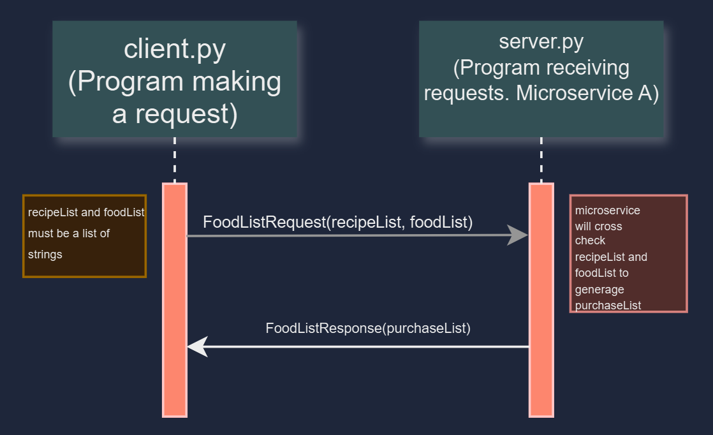

# Microservice-A
Microservice A for Mikaella Shelby

How to Request and Receive Data: 
    The microservice server is written in python. You will need to set your environment
    to use python with grpc. Sounds like you have experience with gRPC in the past. 
    I will provide starting docs just in case. The grpc quick start guide is a simple way to set up:
    https://grpc.io/docs/languages/python/quickstart/. The grpc basic tutorial in python
    is also helpful: https://grpc.io/docs/languages/python/basics/.
    Swift gRPC tutorial: https://github.com/grpc/grpc-swift/blob/main/docs/basic-tutorial.md

    Your will need the foodlist.proto file as that defines the protocol buffer message
    type definitions for the microservice's request and response types for the FoodListService.
    The request must have recipeList and foodList. The response must be purchaseList
    You will need to use the foodlist.proto file to generate the client and server code. 
    I believe you are working with the programing language Swift, so your client will likely
    come from Swift side code. 

    The generated python code for server with: "python -m grpc_tools.protoc -I. --python_out=. --grpc_python_out=. foodlist.proto"
    The generated Swift code for cleint with: "protoc -I. --swift_out=. --grpc-swift_out=. foodlist.proto"
    That should generate foodlist_pb2_grpc.py, foodlist_pb2.py and Foodlist.pb.swift, Foodlist.grpc.swift

    A. Sending a request:
    To send a request to the microservice with gRPC you will need to create a channel to the server and a stub. 
    To set up the stub you will need to use the FoodListService, which is the defined service in the .proto file. 
    The request will need to be made on FoodListRequest(recipeList, foodList). The request will need to contain
    recipeList and foodList within the request and must be lists of strings. In python the request looks as follows:
    request = foodlist_pb2.FoodListRequest(recipeList=recipe, foodList=kitchen).
    See the gRPC user guide on how to create a channel, stub, and request in Swift. 
    I have no experience with swift. The foodlist.proto file defines the protocol buffers for requests and responses. 

    B. Reciving a response:
    The microservice will receive the request, process the data, generate a purchaseList and will automatically
    send the response to the client. To get the response in python is as follows:
    response = stub.GetPurchaseList(request). To access the date in the response use response.purchaseList
    To get a response in Swift see the gRPC user guides. I believe the 
    process is very similar, but syntax is slightly different. 

UML diagram:
